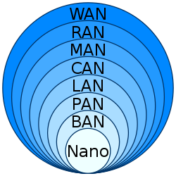
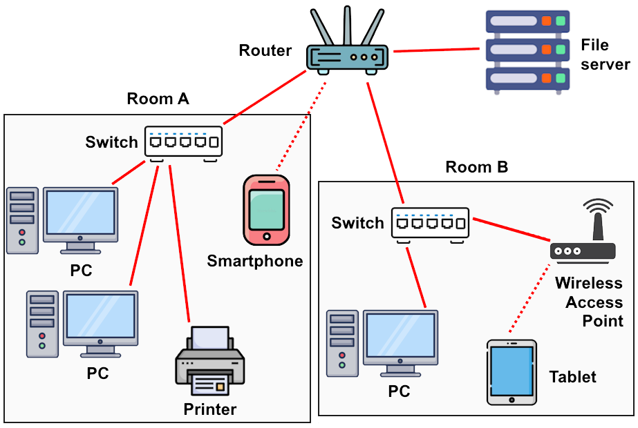

# [Network Types by Scale](https://en.wikipedia.org/wiki/Computer_network#Geographic_scale)

- Nanoscale etwork
- Body area network
- Personal area network
- Local area network
- Campus area network
- Metropolitan area network
- Radio access network
- Wide area network

## Personal area network
- 한 사람을 위한 네트워크
- IT 기기 사이 통신
- USB, Bluetooth

예시
- USB로 노트북에 휴대폰을 연결
- Bluetooth로 자동차에 인이어 마이크 연결

## [Local area network](https://en.wikipedia.org/wiki/Local_area_network)
- 한정된 구역, 가까운 건물
- Ethernet

- LAN, star topology

<table>
  <tr>
    <th>장치</th>
    <th>기능</th>
  </tr>
  <tr>
    <td>스위치</td>
    <td>
      

        이더넷 
        기기 사이 통신
      

    </td>
  </tr>
  <tr>
    <td>라우터, 모뎀, ADSL 모뎀</td>
    <td>
      

        인터넷 
        LAN 바깥 네트워크와 통신
      

    </td>
  </tr>
  <tr>
    <td>Load balancer</td>
    <td>작업을 여러 자원에 분배하는 처리 방법</td>
  </tr>
  <tr>
    <td>방화벽</td>
    <td>보안 규칙에 따라 트래픽을 모니터링하고 제어하는 시스템</td>
  </tr>
  <tr>
    <td>Intrusion detection system (IDS)</td>
    <td>
      

        네트워크 또는 시스템을 감시하는 장치 또는 소프트웨어 
        악의적인 행동, 정책 위반 탐지
      

    </td>
  </tr>
  <tr>
    <td>Wireless access point (WAP)</td>
    <td>
      무선 기기를 네트워크에 연결해주는 장치
    </td>
  </tr>
</table>

### Network Layer (Layer 3) 설정
Dynamic Host Configuration Protocol (DHCP)
- LAN 기기에 내부 IP 할당할때 사용하는 프로토콜
- UDP 기반
- Application layer (Layer 7) 프토로콜

DHCP Server
- 라우터에서 실행됨
- 클라이언트가 DHCP 서버로 네트워크 설정을 요청함
  - IP 주소
  - Default router 주소 (다른 네트워크로 나가는 경로를 알고 있는 라우터)
  - DNS 서버 주소
- 클라이언트가 DHCP 설정을 확인하면 인터넷과 통신할 수 있음

### LAN 사이 연결
연결 방법
- leased lines (전용 회선)
- VPN을 이용한 인터넷

연결 방법, 안정성, 거리에 따라 MAN 또는 WAN으로 분류된다.

### 인터넷 연결
- DSL/ADSL 모뎀 (전화선)
- 셀룰러 모뎀
- 위성 모뎀

## Backbone Network
- LAN 또는 서브네트워크 사이 정보 교환 경로

## [Wide area network](https://en.wikipedia.org/wiki/Wide_area_network)
- 지역, 국가, 세계와 연결된 네트워크
- 먼 거리, 서로 다른 네트워크에서 데이터를 전송하는 기술

### Private network
Private network 패킷은 public router에서 무시된다.
- NAT 기술로 통신 가능

